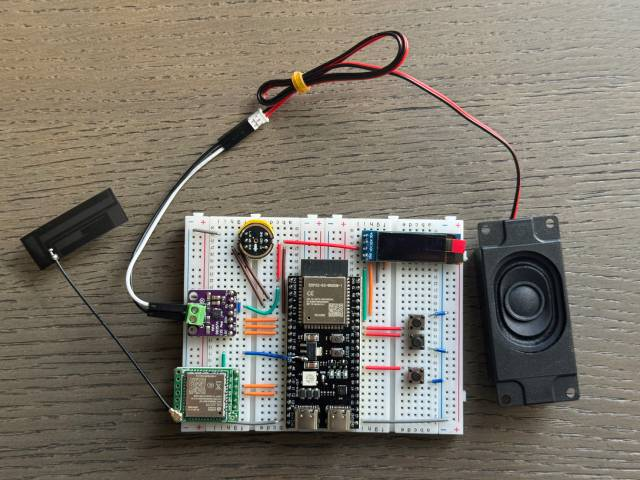
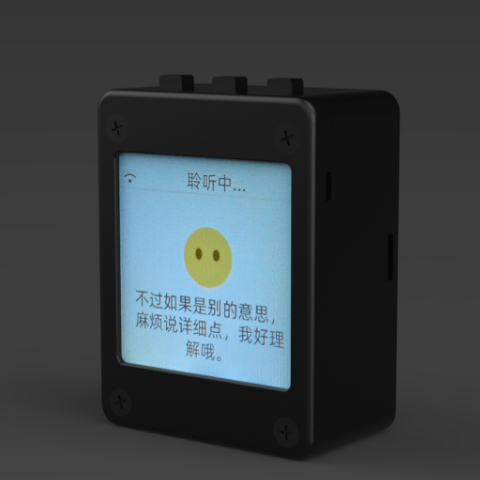
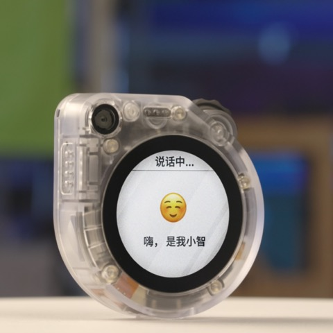
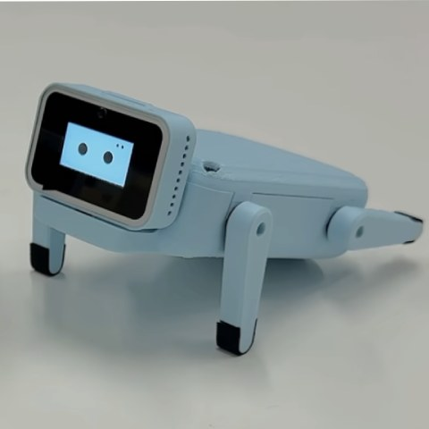

# An MCP-based Chatbot

（中文 | [English](README_en.md) | [日本語](README_ja.md)）

## 介绍

👉 [人类：给 AI 装摄像头 vs AI：当场发现主人三天没洗头【bilibili】](https://www.bilibili.com/video/BV1bpjgzKEhd/)

👉 [手工打造你的 AI 女友，新手入门教程【bilibili】](https://www.bilibili.com/video/BV1XnmFYLEJN/)

小智 AI 聊天机器人作为一个语音交互入口，利用 Qwen / DeepSeek 等大模型的 AI 能力，通过 MCP 协议实现多端控制。

### 版本说明

当前 v2 版本与 v1 版本分区表不兼容，所以无法从 v1 版本通过 OTA 升级到 v2 版本。分区表说明参见 [partitions/v2/README.md](partitions/v2/README.md)。

使用 v1 版本的所有硬件，可以通过手动烧录固件来升级到 v2 版本。

v1 的稳定版本为 1.9.2，可以通过 `git checkout v1` 来切换到 v1 版本，该分支会持续维护到 2026 年 2 月。

### 已实现功能

- Wi-Fi / ML307 Cat.1 4G
- 离线语音唤醒 [ESP-SR](https://github.com/espressif/esp-sr)
- 支持两种通信协议（[Websocket](docs/websocket.md) 或 MQTT+UDP）
- 采用 OPUS 音频编解码
- 基于流式 ASR + LLM + TTS 架构的语音交互
- 声纹识别，识别当前说话人的身份 [3D Speaker](https://github.com/modelscope/3D-Speaker)
- OLED / LCD 显示屏，支持表情显示
- 电量显示与电源管理
- 支持多语言（中文、英文、日文）
- 支持 ESP32-C3、ESP32-S3、ESP32-P4 芯片平台
- 通过设备端 MCP 实现设备控制（音量、灯光、电机、GPIO 等）
- 通过云端 MCP 扩展大模型能力（智能家居控制、PC桌面操作、知识搜索、邮件收发等）
- 自定义唤醒词、字体、表情与聊天背景，支持网页端在线修改 ([自定义Assets生成器](https://github.com/78/xiaozhi-assets-generator))

## 硬件

### 面包板手工制作实践

详见飞书文档教程：

👉 [《小智 AI 聊天机器人百科全书》](https://ccnphfhqs21z.feishu.cn/wiki/F5krwD16viZoF0kKkvDcrZNYnhb?from=from_copylink)

面包板效果图如下：

### 支持 70 多个开源硬件（仅展示部分）

- <a href="https://oshwhub.com/li-chuang-kai-fa-ban/li-chuang-shi-zhan-pai-esp32-s3-kai-fa-ban" target="_blank" title="立创·实战派 ESP32-S3 开发板">立创·实战派 ESP32-S3 开发板</a>
- <a href="https://github.com/espressif/esp-box" target="_blank" title="乐鑫 ESP32-S3-BOX3">乐鑫 ESP32-S3-BOX3</a>
- <a href="https://docs.m5stack.com/zh_CN/core/CoreS3" target="_blank" title="M5Stack CoreS3">M5Stack CoreS3</a>
- <a href="https://docs.m5stack.com/en/atom/Atomic%20Echo%20Base" target="_blank" title="AtomS3R + Echo Base">M5Stack AtomS3R + Echo Base</a>
- <a href="https://gf.bilibili.com/item/detail/1108782064" target="_blank" title="神奇按钮 2.4">神奇按钮 2.4</a>
- <a href="https://www.waveshare.net/shop/ESP32-S3-Touch-AMOLED-1.8.htm" target="_blank" title="微雪电子 ESP32-S3-Touch-AMOLED-1.8">微雪电子 ESP32-S3-Touch-AMOLED-1.8</a>
- <a href="https://github.com/Xinyuan-LilyGO/T-Circle-S3" target="_blank" title="LILYGO T-Circle-S3">LILYGO T-Circle-S3</a>
- <a href="https://oshwhub.com/tenclass01/xmini_c3" target="_blank" title="虾哥 Mini C3">虾哥 Mini C3</a>
- <a href="https://oshwhub.com/movecall/cuican-ai-pendant-lights-up-y" target="_blank" title="Movecall CuiCan ESP32S3">璀璨·AI 吊坠</a>
- <a href="https://github.com/WMnologo/xingzhi-ai" target="_blank" title="无名科技Nologo-星智-1.54">无名科技 Nologo-星智-1.54TFT</a>
- <a href="https://www.seeedstudio.com/SenseCAP-Watcher-W1-A-p-5979.html" target="_blank" title="SenseCAP Watcher">SenseCAP Watcher</a>
- <a href="https://www.bilibili.com/video/BV1BHJtz6E2S/" target="_blank" title="ESP-HI 超低成本机器狗">ESP-HI 超低成本机器狗</a>

  
  
  
  
  
  
  
  
  
  
  
  

## 软件

### 固件烧录

新手第一次操作建议先不要搭建开发环境，直接使用免开发环境烧录的固件。

固件默认接入 [xiaozhi.me](https://xiaozhi.me) 官方服务器，个人用户注册账号可以免费使用 Qwen 实时模型。

👉 [新手烧录固件教程](https://ccnphfhqs21z.feishu.cn/wiki/Zpz4wXBtdimBrLk25WdcXzxcnNS)

### 开发环境

- Cursor 或 VSCode
- 安装 ESP-IDF 插件，选择 SDK 版本 5.4 或以上
- Linux 比 Windows 更好，编译速度快，也免去驱动问题的困扰
- 本项目使用 Google C++ 代码风格，提交代码时请确保符合规范

### 开发者文档

- [自定义开发板指南](docs/custom-board.md) - 学习如何为小智 AI 创建自定义开发板
- [MCP 协议物联网控制用法说明](docs/mcp-usage.md) - 了解如何通过 MCP 协议控制物联网设备
- [MCP 协议交互流程](docs/mcp-protocol.md) - 设备端 MCP 协议的实现方式
- [MQTT + UDP 混合通信协议文档](docs/mqtt-udp.md)
- [一份详细的 WebSocket 通信协议文档](docs/websocket.md)

## 大模型配置

如果你已经拥有一个小智 AI 聊天机器人设备，并且已接入官方服务器，可以登录 [xiaozhi.me](https://xiaozhi.me) 控制台进行配置。

👉 [后台操作视频教程（旧版界面）](https://www.bilibili.com/video/BV1jUCUY2EKM/)

## 相关开源项目

在个人电脑上部署服务器，可以参考以下第三方开源的项目：

- [xinnan-tech/xiaozhi-esp32-server](https://github.com/xinnan-tech/xiaozhi-esp32-server) Python 服务器
- [joey-zhou/xiaozhi-esp32-server-java](https://github.com/joey-zhou/xiaozhi-esp32-server-java) Java 服务器
- [AnimeAIChat/xiaozhi-server-go](https://github.com/AnimeAIChat/xiaozhi-server-go) Golang 服务器

使用小智通信协议的第三方客户端项目：

- [huangjunsen0406/py-xiaozhi](https://github.com/huangjunsen0406/py-xiaozhi) Python 客户端
- [TOM88812/xiaozhi-android-client](https://github.com/TOM88812/xiaozhi-android-client) Android 客户端
- [100askTeam/xiaozhi-linux](http://github.com/100askTeam/xiaozhi-linux) 百问科技提供的 Linux 客户端
- [78/xiaozhi-sf32](https://github.com/78/xiaozhi-sf32) 思澈科技的蓝牙芯片固件
- [QuecPython/solution-xiaozhiAI](https://github.com/QuecPython/solution-xiaozhiAI) 移远提供的 QuecPython 固件

## 关于项目

这是一个由虾哥开源的 ESP32 项目，以 MIT 许可证发布，允许任何人免费使用，修改或用于商业用途。

我们希望通过这个项目，能够帮助大家了解 AI 硬件开发，将当下飞速发展的大语言模型应用到实际的硬件设备中。

如果你有任何想法或建议，请随时提出 Issues 或加入 QQ 群：1011329060

## Star History

<a href="https://star-history.com/#78/xiaozhi-esp32&Date">
 <picture>
   <source media="(prefers-color-scheme: dark)" srcset="https://api.star-history.com/svg?repos=78/xiaozhi-esp32&type=Date&theme=dark" />
   <source media="(prefers-color-scheme: light)" srcset="https://api.star-history.com/svg?repos=78/xiaozhi-esp32&type=Date" />
   
 </picture>
</a>
# echor-xiaozhi

#include "afe_audio_processor.h"
#include <esp_log.h>

#define PROCESSOR_RUNNING 0x01

#define TAG "AfeAudioProcessor"

AfeAudioProcessor::AfeAudioProcessor()
    : afe_data_(nullptr) {
    event_group_ = xEventGroupCreate();
}

void AfeAudioProcessor::Initialize(AudioCodec* codec, int frame_duration_ms, srmodel_list_t* models_list) {
    codec_ = codec;
    frame_samples_ = frame_duration_ms * 16000 / 1000;

    // Pre-allocate output buffer capacity
    output_buffer_.reserve(frame_samples_);

    int ref_num = codec_->input_reference() ? 1 : 0;
    int total_channels = codec_->input_channels();
    
     ESP_LOGI(TAG, "Audio channels: total=%d, reference=%d", total_channels, ref_num);

    std::string input_format;
    for (int i = 0; i < total_channels - ref_num; i++) {
        input_format.push_back('M');
    }
    for (int i = 0; i < ref_num; i++) {
        input_format.push_back('R');
    }
    
    ESP_LOGI(TAG, "Input format: %s", input_format.c_str());
    
    // 保存通道数供后续使用
    total_channels_ = total_channels;
    ESP_LOGI(TAG, "Audio channels saved: total=%d (from codec=%d), reference=%d, input_channels=%d", 
             total_channels_, total_channels, ref_num, codec_->input_channels());
    
    // 安全检查：确保保存的值合理
    if (total_channels_ <= 0 || total_channels_ > 8) {
        ESP_LOGW(TAG, "Warning: total_channels_ has unexpected value: %d, resetting to 2", total_channels_);
        total_channels_ = 2;
    }

    srmodel_list_t *models;
    if (models_list == nullptr) {
        models = esp_srmodel_init("model");
    } else {
        models = models_list;
    }

    char* ns_model_name = esp_srmodel_filter(models, ESP_NSNET_PREFIX, NULL);
    char* vad_model_name = esp_srmodel_filter(models, ESP_VADN_PREFIX, NULL);
    
    afe_config_t* afe_config = afe_config_init(input_format.c_str(), NULL, AFE_TYPE_VC, AFE_MODE_HIGH_PERF);
    afe_config->aec_mode = AEC_MODE_VOIP_HIGH_PERF;
    afe_config->vad_mode = VAD_MODE_0;
    afe_config->vad_min_noise_ms = 100;
    if (vad_model_name != nullptr) {
        afe_config->vad_model_name = vad_model_name;
    }

    if (ns_model_name != nullptr) {
        afe_config->ns_init = true;
        afe_config->ns_model_name = ns_model_name;
        afe_config->afe_ns_mode = AFE_NS_MODE_NET;
    } else {
        afe_config->ns_init = false;
    }

    afe_config->agc_init = false;
    afe_config->memory_alloc_mode = AFE_MEMORY_ALLOC_MORE_PSRAM;

#ifdef CONFIG_USE_DEVICE_AEC
    afe_config->aec_init = true;
    afe_config->vad_init = false;
#else
    afe_config->aec_init = false;
    afe_config->vad_init = true;
#endif

    afe_iface_ = esp_afe_handle_from_config(afe_config);
    afe_data_ = afe_iface_->create_from_config(afe_config);

    xTaskCreate( {
        auto this_ = (AfeAudioProcessor*)arg;
        //this_->test_doa();
        ESP_LOGE(TAG, "xTaskCreate test_doa call");
        this_->AudioProcessorTask();
     
        vTaskDelete(NULL);
    }, "audio_communication", 4096, this, 3, NULL);

}

AfeAudioProcessor::~AfeAudioProcessor() {
    // 清理简单的DOA处理器（静态变量，在程序结束时清理）
    // Note: 由于simple_doa_handle是静态变量，它会在程序结束时自动清理
    // 如果需要显式清理，可以在应用程序退出时调用专门的清理函数
    
    if (afe_data_ != nullptr) {
        afe_iface_->destroy(afe_data_);
    }
    vEventGroupDelete(event_group_);
}

size_t AfeAudioProcessor::GetFeedSize() {
    if (afe_data_ == nullptr) {
        return 0;
    }
    return afe_iface_->get_feed_chunksize(afe_data_);
}

void AfeAudioProcessor::Feed(std::vector<int16_t>&& data) {
    if (afe_data_ == nullptr) {
        return;
    }
    afe_iface_->feed(afe_data_, data.data());
}

void AfeAudioProcessor::Start() {
    xEventGroupSetBits(event_group_, PROCESSOR_RUNNING);
}

void AfeAudioProcessor::Stop() {
    xEventGroupClearBits(event_group_, PROCESSOR_RUNNING);
    if (afe_data_ != nullptr) {
        afe_iface_->reset_buffer(afe_data_);
    }
}

bool AfeAudioProcessor::IsRunning() {
    return xEventGroupGetBits(event_group_) & PROCESSOR_RUNNING;
}

void AfeAudioProcessor::OnOutput(std::function<void(std::vector<int16_t>&& data)> callback) {
    output_callback_ = callback;
}

void AfeAudioProcessor::OnVadStateChange(std::function<void(bool speaking)> callback) {
    vad_state_change_callback_ = callback;
}

void AfeAudioProcessor::AudioProcessorTask() {
    auto fetch_size = afe_iface_->get_fetch_chunksize(afe_data_);
    auto feed_size = afe_iface_->get_feed_chunksize(afe_data_);
    ESP_LOGI(TAG, "Audio communication task started, feed size: %d fetch size: %d",
        feed_size, fetch_size);

    while (true) {
        xEventGroupWaitBits(event_group_, PROCESSOR_RUNNING, pdFALSE, pdTRUE, portMAX_DELAY);

        // 动态调整超时时间，基于缓冲区状态
        TickType_t timeout;
        
        if (consecutive_timeouts_ > 10) {
            // 如果连续超时次数多，增加超时时间
            timeout = pdMS_TO_TICKS(100);
        } else if (buffer_full_count_ > 5) {
            // 如果缓冲区经常满，减少超时时间以加快处理
            timeout = pdMS_TO_TICKS(20);
        } else {
            // 正常情况使用中等超时时间
            timeout = pdMS_TO_TICKS(50);
        }
        
        auto res = afe_iface_->fetch_with_delay(afe_data_, timeout);
        if ((xEventGroupGetBits(event_group_) & PROCESSOR_RUNNING) == 0) {
            continue;
        }
        if (res == nullptr || res->ret_value == ESP_FAIL) {
            if (res != nullptr) {
                if (res->ret_value == ESP_ERR_TIMEOUT) {
                    // 超时是正常情况
                    consecutive_timeouts_++;
                    if (consecutive_timeouts_ % 50 == 0) { // 每50次超时记录一次
                        ESP_LOGD(TAG, "AFE fetch timeout (consecutive: %u)", consecutive_timeouts_);
                    }
                } else {
                    // 其他错误才记录
                    consecutive_timeouts_ = 0; // 重置连续超时计数
                    ESP_LOGI(TAG, "AFE fetch error: %d", res->ret_value);
                }
            }
            continue;
        }

        // 成功获取数据，重置计数器
        consecutive_timeouts_ = 0;
        buffer_full_count_ = 0;
        
        // 记录AFE输出数据信息（用于调试）
        static uint32_t fetch_count = 0;
        fetch_count++;
        if (fetch_count % 200 == 0) { // 每200次记录一次
            ESP_LOGI(TAG, "AFE fetch: data_size=%d, wakeup_state=%d", 
                     res->data_size, res->wakeup_state);
            
            // 详细检查数据大小
            size_t samples = res->data_size / sizeof(int16_t);
            ESP_LOGI(TAG, "AFE data details: data_size=%d, sizeof(int16_t)=%zu, samples=%zu", 
                     res->data_size, sizeof(int16_t), samples);
        }

           
        ESP_LOGI(TAG, "DOA Check:============");
        // 调试：检查 total_channels_ 的值
        ESP_LOGI(TAG, "DOA Check: total_channels_=%d (should be 2)", total_channels_);
        
        // 简单的声源定位检测 - 在单独线程中执行，避免阻塞
        static uint32_t last_doa_time = 0;
        static doa_handle_t* simple_doa_handle = nullptr;
        static std::vector<int16_t> accumulated_audio_data;  // 累积的音频数据
        
        // 累积AFE输出数据
        size_t current_samples = res->data_size / sizeof(int16_t);
        accumulated_audio_data.insert(accumulated_audio_data.end(), res->data, res->data + current_samples);
        
        // 每10秒进行一次DOA检测
        uint32_t current_time = xTaskGetTickCount() * portTICK_PERIOD_MS;
        if (current_time - last_doa_time > 10000) {
            ESP_LOGI(TAG, "DOA Check:============xxxxxxxxx");
            last_doa_time = current_time;
            
            // 安全检查：如果保存的通道数不合理，使用默认值2
            int total_channels = 2;
            size_t required_samples = 1024 * total_channels;
            
            ESP_LOGI(TAG, "DOA Check: accumulated_samples=%zu, total_channels=%d (saved=%d), required_samples=%zu", 
                     accumulated_audio_data.size(), total_channels, total_channels_, required_samples);
            
            // 确保有足够的数据和至少2个通道
            if (accumulated_audio_data.size() >= required_samples && total_channels >= 2) {
                ESP_LOGI(TAG, "DOA Check:============xxxxxxxxxqweqeqeqwewqewqw");
                ESP_LOGI(TAG, "Starting DOA detection in background thread");
                
                // 复制累积的音频数据到堆上
                std::vector<int16_t> audio_data_copy = accumulated_audio_data;
                
                // 在单独线程中执行DOA计算
                std::thread([this, audio_data_copy = std::move(audio_data_copy), total_channels]() {
                    // 在线程中初始化DOA处理器（避免主线程阻塞）
                    if (simple_doa_handle == nullptr) {
                        int sample_rate = 16000;
                        int frame_samples = 1024;
                        float mic_distance = 0.045f;  // 45毫米
                        simple_doa_handle = esp_doa_create(sample_rate, mic_distance, 0.06f, frame_samples);
                        if (simple_doa_handle) {
                            ESP_LOGI(TAG, "Simple DOA initialized in background thread");
                        } else {
                            ESP_LOGE(TAG, "Failed to initialize simple DOA in background thread");
                            return;
                        }
                    }
                    
                    // 提取左右声道数据
                    std::vector<int16_t> left_channel(1024);
                    std::vector<int16_t> right_channel(1024);
                    
                    for (int i = 0; i < 1024; i++) {
                        if (i * total_channels + 1 < audio_data_copy.size()) {
                            left_channel[i] = audio_data_copy[i * total_channels];  // 第一个通道
                            right_channel[i] = audio_data_copy[i * total_channels + 1];  // 第二个通道
                        }
                    }
                    
                    // 进行DOA计算
                    float angle = esp_doa_process(simple_doa_handle, left_channel.data(), right_channel.data());
                    
                    // 打印角度信息
                    ESP_LOGI(TAG, "Sound Source Direction: %.1f degrees", angle);
                }).detach(); // 分离线程，让它独立运行
                
                // 清空累积的数据，重新开始累积
                accumulated_audio_data.clear();
            } else {
                ESP_LOGW(TAG, "DOA conditions not met: accumulated_samples=%zu, channels=%d", 
                         accumulated_audio_data.size(), total_channels);
            }
        }

        // VAD state change
        if (vad_state_change_callback_) {
            if (res->vad_state == VAD_SPEECH && !is_speaking_) {
                is_speaking_ = true;
                vad_state_change_callback_(true);

            } else if (res->vad_state == VAD_SILENCE && is_speaking_) {
                is_speaking_ = false;
                vad_state_change_callback_(false);
            }
        }

        if (output_callback_) {
            size_t samples = res->data_size / sizeof(int16_t);
            
            // Add data to buffer
            output_buffer_.insert(output_buffer_.end(), res->data, res->data + samples);
            
            // Output complete frames when buffer has enough data
            while (output_buffer_.size() >= frame_samples_) {
                if (output_buffer_.size() == frame_samples_) {
                    // If buffer size equals frame size, move the entire buffer
                    output_callback_(std::move(output_buffer_));
                    output_buffer_.clear();
                    output_buffer_.reserve(frame_samples_);
                } else {
                    // If buffer size exceeds frame size, copy one frame and remove it
                    output_callback_(std::vector<int16_t>(output_buffer_.begin(), output_buffer_.begin() + frame_samples_));
                    output_buffer_.erase(output_buffer_.begin(), output_buffer_.begin() + frame_samples_);
                }
            }
        }
    }
}

void AfeAudioProcessor::EnableDeviceAec(bool enable) {
    if (enable) {
#if CONFIG_USE_DEVICE_AEC
        afe_iface_->disable_vad(afe_data_);
        afe_iface_->enable_aec(afe_data_);
#else
        ESP_LOGE(TAG, "Device AEC is not supported");
#endif
    } else {
        afe_iface_->disable_aec(afe_data_);
        afe_iface_->enable_vad(afe_data_);
    }
}

void AfeAudioProcessor::generate_test_frame(int16_t *left, int16_t *right, int frame_size, float angle_deg, int sample_rate)
{
    int TEST_FREQ = 1000;
    static float phase = 0.0f;
    const float d = 0.06f;
    const float c = 343.0f;

    float theta = angle_deg * M_PI / 180.0f;
    float tau = d * cosf(theta) / c;

    int delay_samples = (int)roundf(tau * sample_rate);
    printf("Angle: %f, Delay: %d samples\n", angle_deg, delay_samples);

    for (int i = 0; i < frame_size; i++) {
        float t = (float)(i + phase) / sample_rate;
        left[i] = (int16_t)(sinf(2 * M_PI * TEST_FREQ * t) * 32767);

        int delayed_index = i - delay_samples;
        right[i] = (int16_t)(sinf(2 * M_PI * TEST_FREQ * (delayed_index + phase) / sample_rate) * 32767);
    }
    phase += frame_size;
}

void AfeAudioProcessor::test_doa(){
    ESP_LOGE(TAG, "in AfeAudioProcessor test_doa call");
      // 初始化DOA估计器
      int frame_samples = 1024;
      int sample_rate = 16000;
      int16_t *left = (int16_t *)malloc(frame_samples * sizeof(int16_t));
      int16_t *right = (int16_t *)malloc(frame_samples * sizeof(int16_t));
      int start_size = heap_caps_get_free_size(MALLOC_CAP_8BIT);
      doa_handle_t *doa = esp_doa_create(sample_rate, 20.0f, 0.06f, frame_samples);
  
      uint32_t c0, c1, t_doa = 0;
      int angle = 10;
      for (int f = 0; f < angle; f++) { // 1秒多帧
          generate_test_frame(left, right, frame_samples, f*1.0, sample_rate);
          c0 = esp_timer_get_time();
          float est_angle = esp_doa_process(doa, left, right);
          c1 = esp_timer_get_time();
          t_doa += c1 - c0;
         // ESP_LOGE(TAG, "doa memory size:%d, cpu loading:%f\n", doa_mem_size, (t_doa * 1.0 / 1000000 * sample_rate) / (angle * frame_samples));
   
          ESP_LOGE(TAG,"%.1f\t\t%.1f\n", f*1.0, est_angle); // memory leak
      }
      int doa_mem_size = start_size - heap_caps_get_free_size(MALLOC_CAP_8BIT);
     // ESP_LOGE(TAG, "in AfeAudioProcessor test_doa call");
      ESP_LOGE(TAG, "doa memory size:%d, cpu loading:%f\n", doa_mem_size, (t_doa * 1.0 / 1000000 * sample_rate) / (angle * frame_samples));
   
      esp_doa_destroy(doa);
      int end_size = heap_caps_get_free_size(MALLOC_CAP_8BIT);
  
      // create & destroy 5 times
      for (int i = 0; i < 5; i++) {
          doa = esp_doa_create(sample_rate, 20.0f, 0.06f, frame_samples);
          esp_doa_process(doa, left, right);
          esp_doa_destroy(doa);
      }
  
      int last_end_size = heap_caps_get_free_size(MALLOC_CAP_8BIT);
        ESP_LOGE(TAG, "memory leak:%d\n", start_size - end_size);

      free(left);
      free(right);
      // return 0;
      ESP_LOGE(TAG, "TEST DONE\n\n");
}